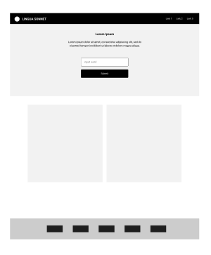
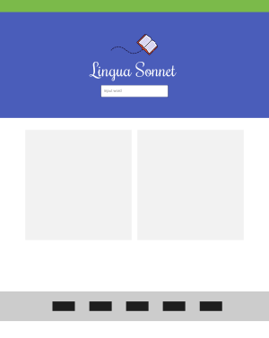
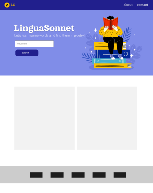
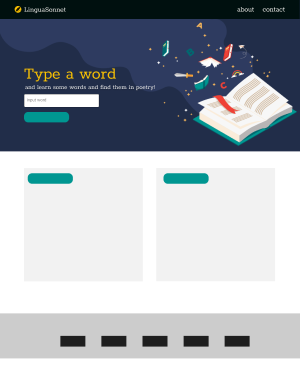
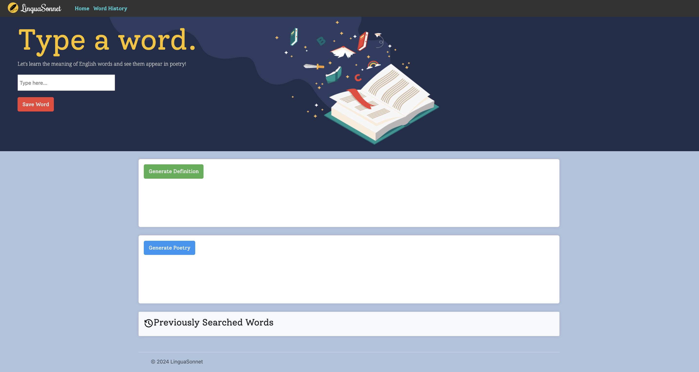

# LinguaSonnet

## Contents

* [Introduction](#introduction)
* [Build](#build)
* [Design](#design)
* [Installation](#installation)
* [Usage](#usage)
* [Credits](#credits)
* [License](#license)
* [Acknowledgments](#acknowledgments)
* [References](#references)

## Introduction

### Project Brief

The aim of this project was to collaboratively build a web application, which meets the following criteria:

* Makes use of `Bootstrap` and (at least) two server-side APIs.
* Uses modals (rather than alerts, confirms or prompts).
* Is interactive (e.g. accepts and responds to user input).
* Makes use of client-side storage to store persistent data.
* Has a polished user interface.

### Project Description

To meet the above brief, the project team conceptualised _“LinguaSonnet”_.

LinguaSonnet is a web application which seamlessly combines word learning with poetry, allowing users to access word definitions and examples of the word in a poem.

### The Problem and Solution

_Problem: Understanding the meaning of English words and how they might be used in poetry._

LinguaSonnet provides a novel solution to word learning; a one-stop-shop for users to access word definitions and examples of how the word is used in a well known poem.

### User Story and Primary Audience

_Story: As a student learning the English language, I want to find out the meaning of English words and examples of how the word is used in “real life” (e.g. poetry), so that I can understand how to use the word in my own English speech and writing._

Further to the user story, LinguaSonnet’s primary audience is people studying and learning the English language. This may include users who are learning English as a second language or (in fact) anyone looking to expand their vocabulary of the English language.

## Build

### Phases of the Build

#### Proposal

* *Project conceptualisation:* Consider ideas to meet the project brief, agree upon these and define the project title and description.

* *User story and audience:* craft a user story and identify the primary audience.

#### Research

* *Potential APIs:* explore options for APIs and read the subsequent API documentation.

* *Design resources*: research options for images, font and other styling.

* *Front-end frameworks:* consider possible options for frameworks and review Bootstrap’s documentation.

#### Planning

* *Tasks:* identify the required tasks to build the project and the roles each project team member will take, create a [Kanban Board](https://github.com/users/Code0Em/projects/2) with GitHub Projects to help visualise this and track progress.

* *Wireframes:* create a [visual representation of the project's interface](#wireframes), and create subsequent iterations/versions of this (as required).

#### Build

* *GitHub Repo:* create a GitHub repository for the project.

* *HTML:* create the basic structure of the HTML file, including links to front-end frameworks (as required).

* *CSS:* create the CSS file, to style and layout the application.

* *JavaScript:* write pseudocode to outline the logic and flow of the program, and build Javascript to implement the functionality of the application.

### Built With

As per the project criteria, some of the application’s styling relies upon `Bootstrap`.

The application is built with `vanilla javascript`, and the `javascript` file has been commented throughout with pseudocode (breaking the project into tasks, and comments have been added to explain the functionality of the code).

The application also makes use of `local storage` to save users’ previously searched words; when the user inputs a word and selects the save button, the word is saved to local storage and a corresponding button is created. When the user then selects this button, the word is retrieved from the local storage and the user has the option to generate a definition and/or poem for this word again.

The application also makes use of two APIs:

* [`PoetryDB`](https://github.com/thundercomb/poetrydb#readme).
* [`Free Dictionary API`](https://dictionaryapi.dev/).

## Design

### Wireframes

1. **Proposal stage**

      
      
2. **Redesigned structure**

      

3. **Mockups in Figma**

      

      

      

### Design Resources:

 - Quill Icon from [FlatIcon](https://www.flaticon.com/free-icons/write).

 - Hero image from World Book Day ([Freepik](https://www.freepik.com/free-vector/flat-world-book-day-landing-page-template_23671548.htm)).

 - Serif Font: Solway
   Author: Mariya V. Pigoulevskaya,The Northern Block ([Google Fonts](https://fonts.google.com/specimen/Solway)).

 - Cursive Font: Rochester 
   Author: Sideshow, Principal design ([Google Fonts](https://fonts.google.com/specimen/Rochester/about)).

 - Serif Body Font: Noto Serif 
   Open Font License ([Google Fonts](https://fonts.google.com/specimen/Rochester/about)).

 - Color swatches ([Coolors](https://coolors.co/)).

 - Initial Wireframe: [Excalidraw](https://excalidraw.com/)

 - Final Wireframes: [Figma](https://www.figma.com/file/xoPXnb1ccMeaeD6PsbHd1D/Bootcamp-Project-1?type=design&node-id=0%3A1&mode=design&t=Z9o1z2tuMld0zLTy-1)

 - Fluid Jumbotron style containers and cards ([Bootstrap](https://getbootstrap.com/docs/5.0/examples/heroes/)).

 - Bootstrap cheatsheet ([Hackertheme](https://hackerthemes.com/bootstrap-cheatsheet/)).

 ## Installation

N/A

## Usage

**LINK TO DEPLOYED APPLICATION**

Deployed Website: https://code0em.github.io/lingua-sonnet/

**SCREENSHOT OF DEPLOYED APPLICATION TO BE ADDED**

## Credits

Credits have been included in the code comments of the `javascript` file and cited above (under [Design Resources](#design-resources)) and below (under [References](#references)).

## License

Distributed under the MIT License. See `LICENSE.txt` for more information.

## Acknowledgments

The project team conceptualised, designed and built _“LinguaSonnet”._

The team consists of [@codeswitchstudio](https://github.com/codeswitchstudio), [@Code0Em](https://github.com/Code0Em) and [@Sandesh2034](https://github.com/Sandesh2034).

## References

ChatGPT (2024) (https://chat.openai.com/chat).

Stack Overflow (2016) [*Fetch resolves even if 404?*](https://stackoverflow.com/questions/39297345/fetch-resolves-even-if-404).

Mojtaba Seyedi (2022) [*Call modal manually with vanilla JavaScript in Bootstrap 5*](https://www.youtube.com/watch?v=XUhdzIO6lgg).

